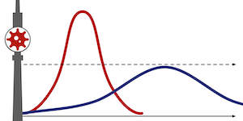

# Coronavirus Cases Scraper for Berlin



### Quick Links

* [Timeline of case numbers](data/target/berlin_corona_cases.json)
* [Timeline of traffic light indicators ("Corona Ampel")](data/target/berlin_corona_traffic_light.json)

This is a scraper for the [Corona/COVID-19 dashboard for Berlin](https://www.berlin.de/corona/lagebericht/desktop/corona.html), as issued by the [Senatsverwaltung für Gesundheit, Pflege und Gleichstellung](https://www.berlin.de/sen/gpg/) (Senate Department for Health, Care and Equality) and the [Landesamt für Gesundheit und Soziales](https://www.berlin.de/lageso/) (Regional Office for Health and Social Affairs).
The dashboard includes daily case numbers by district and age groups, as well as the "Corona traffic light"-indicators (incidence of new infections per week, ICU occupancy rate, relative change in incidence).

* Change in the 7-day incidence was dropped again on September 2nd, 2021.
Instead, the 7-day indicence for hospitalisation was introduced as a new traffic light indicator on that day.
Also, the color scheme for the incidence traffic light was adjusted: where before it was yellow at >=20% and red at >=40%, it is now yellow at >=35% and red at >=100%.
This of course makes it pointless to compare the color values before and after 2021-09-02.
* The basic reproduction number R was included until July 22nd, 2021.
After that, [R was dropped because it was no longer deemed a useful indicator](https://data.lageso.de/lageso/corona/archiv/berlin-website-2021-07-23.html "Berliner Corona-Lagebericht vom 23.07.2021").
Instead, the relative change in incidence is now the third indicator in the corona traffic light.
R is still included in the output data (as `0.0`), since some apps might expect to find it there.
* Starting with February 15, 2021, the absolute numbers and percentages for administered vaccinations are included in the dashboard.
* Starting with November 11, 2020, the change in the 7-day incidence is also included in the traffic light indicators.
* As of August 31, 2020, the dashboard [replaces the previously used daily press releases](https://www.berlin.de/sen/gpg/service/presse/2020/pressemitteilung.983232.php "SenGPG press release announcing the new Corona/COVID-19 dashboard from 2020-08-31") containing the same data.
There were two separate press releases each day, one with the case numbers (see [here](https://www.berlin.de/sen/gpg/service/presse/2020/pressemitteilung.982684.php "Last SenGPG press release with Corona/COVID-19 case numbers for Berlin from 2020-08-30") for the last one) and one with the traffic light indicators (see [here](https://www.berlin.de/sen/gpg/service/presse/2020/pressemitteilung.982682.php "Last SenGPG press release with Corona/COVID-19 traffic light indicators for Berlin from 2020-08-30") for the last one of those).


The output of the scraper are timelines of data extracted from the individual press releases.

## Output Data

_Note that there is no data for 2021-05-06, because on that day, the reporting was changed from same-day-evening to next-day-noon.
See [this note](note20210506.md) for more information._

### Corona Case Numbers

The timeline data generated by the case number scraper is a JSON file in [data/target/berlin_corona_cases.json](data/target/berlin_corona_cases.json), structured as follows:

```json
[
  {
    "date": "2020-09-23",
    "source": "https://www.berlin.de/corona/lagebericht/desktop/corona.html",
    "counts_per_district": {
      "lor_01": {
        "case_count": 2141,
        "indicence": 555.0,
        "recovered": 1894
      },
      "lor_02": {
        "case_count": 1359,
        "indicence": 468.0,
        "recovered": 1176
      },
      ...
      "lor_12": {
        "case_count": 974,
        "indicence": 365.6,
        "recovered": 897
      }
    },
    "counts_per_age_group": {
      "0-4": {
        "case_count": 358,
        "incidence": 188.7
      },
      "5-9": {
        "case_count": 406,
        "incidence": 236.5
      },
      ...
      "90+": {
        "case_count": 156,
        "incidence": 500.6
      },
      "unknown": {
        "case_count": 15,
        "indidence": "n.a."
      }
    }
  },
  {
    "date": "2020-09-22",
    "source": "https://www.berlin.de/corona/lagebericht/desktop/corona.html",
    "counts_per_district": {
      "lor_01": {
        "case_count": 2116,
        "indicence": 548.5,
        "recovered": 1877
      },
      "lor_02": {
        "case_count": 1330,
        "indicence": 458.0,
        "recovered": 1154
      },
      ...
      "lor_12": {
        "case_count": 967,
        "indicence": 363.0,
        "recovered": 890
      }
    },
    "counts_per_age_group": {
      "0-4": {
        "case_count": 356,
        "incidence": 187.6
      },
      "5-9": {
        "case_count": 399,
        "incidence": 232.4
      },
      ...
      "90+": {
        "case_count": 155,
        "incidence": 497.4
      },
      "unknown": {
        "case_count": 15,
        "indidence": "n.a."
      }
    }
  },
  ...
]
```

The structure of the data is a JSON array with objects for each day.
For each day, the `source` is specified (where was the data scraped from – this used to be a particular press release, now it is always the dashboard), the `date` (of the data), the `counts_per_district` and the `counts_per_age_group`.
For the days scraped from individual press releases, there is also a `pr_date` attribute (when was the press release issued), because `pr_date` and `date` are not always the same day.

#### Counts per District

The `counts_per_district` objects are structured with a key for each district, which in turn contain the actual numbers for the total `case_count`, `incidence` and number of `recovered` cases.

The district keys are their [LOR codes](data/manual/lor_district_codes.json) (see the dataset [Lebensweltlich orientierte Räume (LOR) in Berlin](https://daten.berlin.de/datensaetze/lebensweltlich-orientierte-räume-lor-berlin "The dataset 'Lebensweltlich orientierte Räume (LOR) in Berlin' on the Berlin Open Data Portal") for a complete definition of each LOR code):

```json
{
    "lor_01": "Mitte",
    "lor_02": "Friedrichshain-Kreuzberg",
    "lor_03": "Pankow",
    "lor_04": "Charlottenburg-Wilmersdorf",
    "lor_05": "Spandau",
    "lor_06": "Steglitz-Zehlendorf",
    "lor_07": "Tempelhof-Schöneberg",
    "lor_08": "Neukölln",
    "lor_09": "Treptow-Köpenick",
    "lor_10": "Marzahn-Hellersdorf",
    "lor_11": "Lichtenberg",
    "lor_12": "Reinickendorf"
}
```

#### Counts per Age Group

The `counts_per_age_group` objects are similarly structured, with a key for each age group, which in turn contain the `case_count` and `incidence` (no `recovered`).
The age group `80+` was split into `80-89` and `90+` beginning May 11th (2020-05-11).

There is a special `unknown` age group for which the `incidence` is always `n.a.`

#### Manually Extracted Data

Some of the earlier press releases had a slightly different format, or were only available as screen shots (true story), so the [old press release scraper](https://github.com/knudmoeller/berlin_corona_cases/tree/0.2.4 "Release 0.2.4 of the 'Coronavirus Cases Scraper for Berlin'") did not work for them.
Rather than writing special code for extracting these one- or two-off cases, I manually extracted them and put them in [data/manual/manually_extracted.json](data/manual/manually_extracted.json).
When creating the complete timeline, this manually extracted data was then merged with the newly scraped data.

### Corona Traffic Light Indicators and Vaccination

The traffic light and vaccination data generated by the scraper is a JSON file located in [data/target/berlin_corona_traffic_light.json](data/target/berlin_corona_traffic_light.json). 
This data contains a timeline of how the traffic light indicators changed over time.

Starting February 15, 2021, the Corona dashboard includes data on vaccination. This has been added to the traffic light JSON file.
While it is not strictly speaking one of the traffic light indicators, it is still an important indicator for the overall situation regarding the pandemic in Berlin.

There is a second JSON file in [data/target/berlin_corona_traffic_light.latest.json](data/target/berlin_corona_traffic_light.latest.json) which always contains the latest traffic light indicators.

The structure is as follows:

```json
[
  {
    "source": "https://www.berlin.de/corona/lagebericht/desktop/corona.html",
    "pr_date": "2021-09-02",
    "indicators": {
      "basic_reproduction_number": {
        "color": "",
        "value": 0.0
      },
      "incidence_new_infections": {
        "color": "yellow",
        "value": 83.2
      },
      "icu_occupancy_rate": {
        "color": "yellow",
        "value": 5.4
      },
      "change_incidence": {
        "color": "",
        "value": 0.0
      },
      "incidence_hospitalisation": {
        "color": "green",
        "value": 1.3
      }
    },
    "vaccination": {
      "total_administered": 4503235,
      "percentage_one_dose": 65.2,
      "percentage_two_doses": 60.4
    }
  },
  ...
  {
    "source": "https://www.berlin.de/sen/gpg/service/presse/2020/pressemitteilung.982682.php",
    "pr_date": "2020-08-30",
    "indicators": {
      "basic_reproduction_number": {
        "value": 1.1,
        "color": "green"
      },
      "incidence_new_infections": {
        "value": 12.5,
        "color": "green"
      },
      "icu_occupancy_rate": {
        "value": 1.5,
        "color": "green"
      }
    }
  },
  ...
]
```

The structure of the data is a JSON array with objects for day.
Each day specifies the `source` (where was the data scraped from – this used to be a particular press release, now it is always the dashboard), the `pr_date` (date when this particular set of indicators was announced – this used to be the date of the press release), an `indicators` object and a `vaccination` object (starting 2021-02-15).
`indicators` in turn contains the indicators `incidence_new_infections` (incidence of new infections per 100,000 inhabitants per week) and `icu_occupancy_rate` (the ICU occupancy rate in %: which percentage of the available ICU capacity is currently being used).
On 2020-11-11 another indicator was introduced: the change in 7-day incidence (_"Veränderung der 7-Tage-Inzidenz"_).
This indicator is included as `change_incidence` (the number shows the change in percent).
`change_incidence` was dropped again on 2021-09-02 (still included as `0.0` for backwards-compatibility) and replaced with a new indicator `incidence_hospitalisation`.
`basic_reproduction_number` (basic reproduction number R) was recorded until 2021-07-22.
After that, it is only included as `0.0`, in case applications rely on it to be there.

Each indicator has a numeric `value` and a traffic light `color`-code (one of [`green`, `yellow`, `red`]).
For the exact meaning of color codes please refer to the corona dashboard.
Note that the meaning of the color codes was adjusted on 2021-09-02.

`vaccination` shows the total number of administered doses of COVID-19 vaccinations, as well as the percentage of the population that has received one or two doses, respectively.

## Running the Scraper

### Running Automatically with GitHub Actions

The scraper runs automatically every day, several times starting midday (around the time when the dashboard is usually updated).
Previously, the scraper ran in the afternoon.
This changed on 2021-05-07, when the update times for the dashboard moved to noon the following day.

To run the scraper at the specified times, I have defined a workflow in [.github/workflows/scraper.yml](.github/workflows/scraper.yml) for [GitHub Actions](https://github.com/features/actions), GitHub's continuous integration framework.
The workflow 

* sets up a virtual machine,
* checks out the repository,
* runs the scraper and
* commits and pushes the updated data if there are changes.

Setting up the workflow was surprisingly easy, so I'd definitely recommend this if you want to regularly run a scraper and don't want to push the button yourself every day!

[@jaimergp](https://github.com/jaimergp) and later also [@graste](https://github.com/graste) recommended doing this, and I'm very grateful for the inspiration!
I had no idea gh-actions included a cron-based trigger that makes this possible ...

[@simonw](https://github.com/simonw)'s blog post at https://simonwillison.net/2020/Oct/9/git-scraping/ is a very good starting point if you want to learn how to do [git-scraping](https://github.com/topics/git-scraping).

### Running Manually

If you want to run the scraper yourself manually (maybe you want to improve it), you can. Here is how:

#### Requirements

* Ruby 2.7.1 (most likely works with other versions too, I haven't tried)
* the [Nokogiri](https://nokogiri.org) gem
* the [jq](https://stedolan.github.io/jq/) JSON processor (jq is not a hard requirement anymore – it's only used to extract the current day for [data/target/berlin_corona_traffic_light.latest.json](data/target/berlin_corona_traffic_light.latest.json)).

#### Installation

- First, make sure you have Ruby installed.
- If you have the [Bundler](https://bundler.io) tool, you can install the gem (Ruby library) dependencies like this:

```bash
$ bundler install
# ... output from bundler ...
```

- If you don't have bundler (you should get it), just install the dependencies individually with `gem`.
Since there is currently really only one non-standard gem dependency, this is no less convenient:

```bash
$ gem install nokogiri
# ... output from gem ...
```

- Finally, download this repository to a place of your choosing, or use `git clone`.

#### Make Targets

There is a [Makefile](Makefile) that orchestrates the scraping.
The targets should be easy to understand (each one has an `echo` statement that verbosely says what it does).

To create the complete timeline for both case numbers and traffic light indicators, use the `all` target.
You should get output like this:

```
$ make all
deleting temp folder ...
creating temp directory ...
running corona dashboard parser ...
I, [2020-09-24T22:17:27.647621 #99403]  INFO -- : reading current case number file data/target/berlin_corona_cases.json ...
I, [2020-09-24T22:17:27.664712 #99403]  INFO -- : reading current traffic light file data/target/berlin_corona_traffic_light.json ...
I, [2020-09-24T22:17:27.666040 #99403]  INFO -- : loading and parsing dashboard from https://www.berlin.de/corona/lagebericht/desktop/corona.html ...
I, [2020-09-24T22:17:30.703220 #99403]  INFO -- : getting publication date ...
I, [2020-09-24T22:17:30.712117 #99403]  INFO -- : publication date is 2020-09-24 ...
I, [2020-09-24T22:17:30.712160 #99403]  INFO -- : extracting case number data ...
I, [2020-09-24T22:17:30.733268 #99403]  INFO -- : extracting traffic light data ...
copying data from data/temp/berlin_corona_cases.json to data/target/berlin_corona_cases.json ...
copying data from data/temp/berlin_corona_traffic_light.json to data/target/berlin_corona_traffic_light.json ...
extracting latest set of traffic light indicators from data/target/berlin_corona_traffic_light.json ...
writing to data/target/berlin_corona_traffic_light.latest.json ...
write current date ...
update README.md with current date
```

## What Happened to the Old Scraper?

Initially, I had written a Python-based scraper for the daily press releases, using the [Scrapy](https://scrapy.org) Web-scraping framework.
When SenGPG stopped publishing those press releases, the scraper was no longer functional.
For a few days I "scraped" manually, until I got a new scraper for the dashboard running.
The new scraper is Ruby-based and uses [Nokogiri](https://nokogiri.org).
This doesn't mean I now think Scrapy is bad – far from it, it's great!
It's just that for the task of scraping all individual Corona press releases, starting from a paged index of press releases, Scrapy has some pretty handy functionality.
Also, I just wanted to try it out.
For simply scraping the same dashboard page every day, Scrapy seemed overkill, and I have more experience using Ruby and Nokogiri.
It was just easier for me personally.

If you're looking for the old Scrapy-based scraper, you can still find it in [release 0.2.4](https://github.com/knudmoeller/berlin_corona_cases/tree/0.2.4 "Release 0.2.4 of the 'Coronavirus Cases Scraper for Berlin'").

## Logo

- [virus](https://fontawesome.com/icons/virus) logo by [FontAwesome](https://fontawesome.com) under [CC BY 4.0](https://creativecommons.org/licenses/by/4.0/).

## License

All software in this repository is published under the [MIT License](LICENSE).
All data in this repository (in particular the `.json` files) is published under [CC BY 3.0 DE](https://creativecommons.org/licenses/by/3.0/de/).

## Disclaimer

I do not make any claims that the data in [data/target/berlin_corona_cases.json](data/target/berlin_corona_cases.json) is correct!
If you find bugs in the code or in the data, please let me know by opening an issue [here](https://github.com/knudmoeller/berlin_corona_cases/issues).

---

2020, Knud Möller

Repository: [https://github.com/knudmoeller/berlin_corona_cases](https://github.com/knudmoeller/berlin_corona_cases)

Last changed: 2022-08-06
