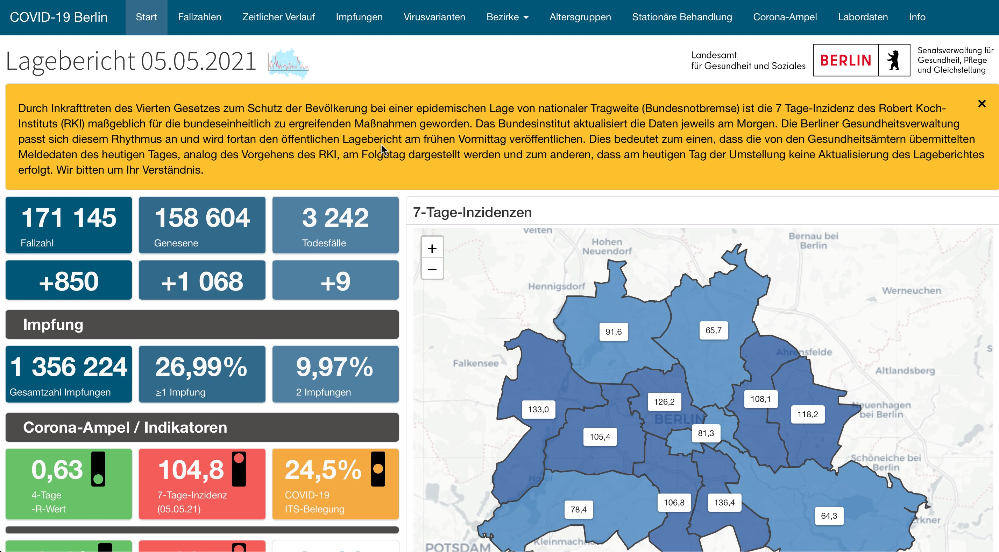

# Changed Update-Times

> Durch Inkrafttreten des Vierten Gesetzes zum Schutz der Bevölkerung bei einer epidemischen Lage von nationaler Tragweite (Bundesnotbremse) ist die 7 Tage-Inzidenz des Robert Koch-Instituts (RKI) maßgeblich für die bundeseinheitlich zu ergreifenden Maßnahmen geworden.
> Das Bundesinstitut aktualisiert die Daten jeweils am Morgen.
> Die Berliner Gesundheitsverwaltung passt sich diesem Rhythmus an und wird fortan den öffentlichen Lagebericht am frühen Vormittag veröffentlichen.
> Dies bedeutet zum einen, dass die von den Gesundheitsämtern übermittelten Meldedaten des heutigen Tages, analog des Vorgehens des RKI, am Folgetag dargestellt werden und zum anderen, dass am heutigen Tag der Umstellung keine Aktualisierung des Lageberichtes erfolgt.
> Wir bitten um Ihr Verständnis.

[COVID-19 Berlin Lagebericht](https://www.berlin.de/corona/lagebericht/desktop/corona.html) ("Dashboard"), 2021-05-06